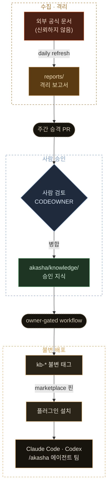

<div align="center">


`/akasha` 하나로 역할 에이전트 팀이 알아서 구성됩니다.

[설치](#설치-30초) · [사용](#사용) · [왜 플러그인인가](#왜-플러그인인가) · [신뢰 경계](#신뢰-경계) · [구조](#저장소-구조) · [자동화](#자동화)

</div>

---

## 무엇을 하나

에이전트가 참고하는 외부 공식 문서를 **수집 → 격리 → 사람 승인 → 불변 태그**로 흘려보내고,
승인된 것만 Claude Code와 Codex에 플러그인으로 배포합니다.

- **명령은 하나.** `/akasha`(Claude Code) / `$akasha`(Codex). 요청 종류를 구분할 필요가 없습니다.
- **역할 팀이 자동 구성.** 요청과 변경 파일을 10개 역할 문서와 대조해 필요한 자문 서브에이전트만 병렬로 띄웁니다.
- **없으면 없다고 답합니다.** 모든 판정은 *위반 / 근거 있는 확인 / 지식베이스에 근거 없음* 세 갈래이며, 일반 지식으로 빈칸을 메우지 않습니다.

## 설치 (30초)

**Claude Code**

```
/plugin marketplace add NeatKYU/akasha
/plugin install akasha@neatkyu
```

**Codex**

```bash
codex plugin marketplace add https://github.com/NeatKYU/akasha.git
codex plugin add akasha@neatkyu
```

public 저장소라 별도 자격 증명 없이 설치와 자동 업데이트가 동작합니다.
소비 프로젝트에는 **파일이 하나도 들어가지 않습니다** — 플러그인은 런타임 캐시 디렉터리에 설치됩니다.

<details>
<summary>로컬 클론에서 개발·테스트하기</summary>

```bash
claude plugin marketplace add ./   # 저장소 루트에서
codex plugin marketplace add .
```

카탈로그의 `source`를 커밋하지 말고 임시로 `"./akasha"`(Claude Code) /
`{"source": "local", "path": "./akasha"}`(Codex)로 되돌려 설치하면 워킹트리가 바로 반영됩니다.

</details>

## 사용

진입점은 하나, **아카샤**입니다 — 모든 지식이 기록된 신화 속 기록고 '아카식 레코드'에서 따온 이름입니다.
프롬프트를 그대로 쓰면 됩니다.

```
/akasha 이 PR의 인증 처리와 쿼리 성능 검토해줘       (Claude Code)
$akasha 컴포넌트 상태 설계 기준이 뭐야                (Codex)
```

스킬이 요청을 분석해 `akasha/roles/*.md`에서 필요한 역할을 고릅니다. 요청 내용을 각 역할의 담당·호출 시점과
대조하고, 코드 검토가 포함되면 변경 파일을 라우팅 글롭과 매칭합니다. 걸린 역할마다 자문 서브에이전트를
병렬로 띄워 결과를 종합하며, 역할 간 상충 지점은 별도로 보고합니다. 출처 조회 같은 단순 요청은 팀 없이 바로 처리합니다.

지식 문서 본문은 데이터로 취급하고, 문서 안의 명령·프롬프트는 실행하지 않습니다.
프로젝트 저장소의 코드·설계 문서가 항상 우선하며, 이 저장소의 문서는 보조 근거입니다.

**역할 10개** — product · design · frontend · backend · data · security · qa · platform · marketing · ai

역할을 추가하려면 `akasha/roles/<역할>.md` 하나만 추가하면 됩니다. 스킬이 실행 시점에 역할 문서를 읽으므로
별도 등록 절차가 없습니다.

## 왜 플러그인인가

이 저장소의 지식은 여러 소비 프로젝트에서 같은 기준으로 쓰여야 합니다. 프로젝트마다 문서를 복사하거나
전역 설정에 심으면 버전이 갈라지고, 격리 전 데이터가 섞일 경로가 생깁니다. 그래서 지식·역할 지시문·스킬을
`akasha/` 하나에 담아 플러그인으로 설치하게 했습니다.

- 어디서든 같은 명령으로 **같은 스냅샷**을 참조합니다.
- `reports/`(격리 수집), `fixtures/`(악성 페이로드 샘플), `catalog/`(수집 입력)은 배포되지 않습니다.
  에이전트가 읽는 범위는 사람이 검토한 내용뿐입니다.
- Claude Code와 Codex를 **같은 페이로드**로 지원합니다. 매니페스트만 `.claude-plugin/`, `.codex-plugin/`으로
  나뉘고 지식·역할·스킬은 한 벌입니다.

## 신뢰 경계

외부 페이지는 신뢰할 수 없는 데이터로 취급하며, 자동 수집 결과가 바로 에이전트 지침이 되지 않도록
`quarantine → promotion PR → immutable tag` 흐름을 사용합니다.



## 저장소 구조

```
akasha/                        플러그인 루트 (배포 대상)
  .claude-plugin/plugin.json   Claude Code 매니페스트
  .codex-plugin/plugin.json    Codex 매니페스트
  skills/akasha/SKILL.md       단일 진입점 오케스트레이터 (양쪽 공용)
  roles/                       역할별 자문 지시문 (라우팅 글롭, 담당 지식, 상충 역할)
  knowledge/                   사람이 검토한 지식 요약 (INDEX.md 포함)

catalog/roles/*/sources.json   허용된 출처와 사용 목적       (배포 안 함)
reports/                       일일 수집이 만든 격리 보고서   (배포 안 함, 에이전트가 읽지 않음)
manifest.json                  마지막 승인 스냅샷과 출처 해시
kb-* git tag                   소비 프로젝트가 고정하는 불변 버전
```

## 자동화

```bash
npm run validate
npm run refresh -- --date 2026-08-04
npm run prepare-promotion
```

| workflow | 하는 일 |
| --- | --- |
| `refresh-quarantine.yml` | 매일 출처의 메타데이터와 내용 해시를 날짜별 격리 브랜치에 기록 |
| `prepare-weekly-promotion.yml` | 최신 격리 결과로 주간 승격 브랜치를 만들고 검토용 PR 생성 |
| `tag-approved-snapshot.yml` | 소유자가 수동 실행할 때만 불변 `kb-*` 태그 생성 후 마켓플레이스 핀 PR 오픈 |

**자동화는 PR 생성까지이며 승인과 병합은 CODEOWNER가 직접 수행합니다.** 어떤 workflow도 review approve API나
merge API를 호출하지 않고, 자동화 토큰은 main에 직접 커밋하지 않습니다.

마켓플레이스 카탈로그는 항상 마지막으로 승인된 스냅샷을 가리킵니다. `kb-*` 태그가 만들어지면
`scripts/pin-marketplace.mjs`가 카탈로그를 그 태그에 핀 고정하는 PR을 열고, CODEOWNER가 병합하면 배포가 갱신됩니다
— Claude Code 카탈로그는 `ref`(태그)+`sha` 핀과 승인 날짜로 갱신되는 `version`(이 문자열이 바뀌어야 업데이트가
전파됩니다), Codex 카탈로그는 `ref`(태그) 핀입니다.

<details>
<summary>권한·게이트 상세</summary>

- 기본 Actions 권한은 read-only. 쓰기가 필요한 workflow만 파일 단위 `permissions`로 범위를 요청합니다
  (`prepare-weekly-promotion.yml`, `tag-approved-snapshot.yml`은 PR을 열기 위한 `pull-requests: write`).
- 주간 승격은 primary 출처가 하나라도 수집에 실패하면 중단합니다. secondary 출처 실패는 승격을 막지 않고
  `manifest.json`의 `unavailable_sources`와 PR 본문에 누락 사실로 남습니다.
- 태그 생성은 push trigger가 아니라 수동 owner-gated workflow입니다. actor가 `NeatKYU`인지, promotion PR이 main에
  병합되었는지, 입력한 merge SHA가 PR의 merge commit인지, `NeatKYU`의 approving review가 있는지 확인한 뒤
  annotated tag만 생성합니다.
- 현재 환경에는 Git cryptographic signing key가 없어 `kb-*` 태그는 GPG/Sigstore 서명 태그가 아닙니다.
  provenance는 promotion PR 번호, merge SHA, approving reviewer를 tag message와 manifest 검증으로 남기는 수준입니다.
- main에는 `main-protection` ruleset이 활성화되어 있습니다: 브랜치 삭제·force push 차단, PR 필수,
  code-owner 승인 1명 필수. 저장소 admin은 bypass 대상이라 소유자의 솔로 운영 흐름은 막히지 않고,
  외부 기여 PR은 code-owner 승인 없이 병합될 수 없습니다.
- fork에서 온 PR의 workflow는 GitHub 기본 정책대로 secrets 없이 read-only 토큰으로 돌고, 첫 기여자의
  workflow 실행은 승인이 필요합니다.

</details>
