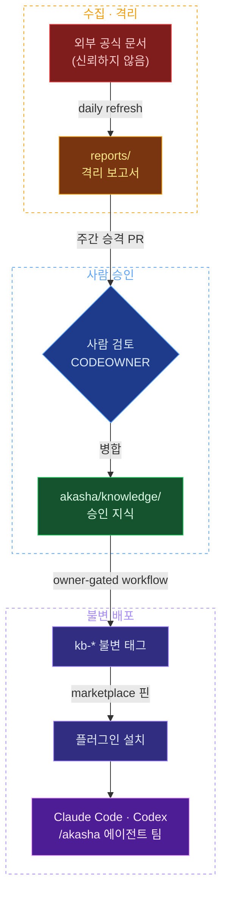

<div align="center">


**사람이 승인한 지식만, 어디서든 같은 명령으로.**
`/akasha` 하나로 역할 에이전트 팀이 알아서 구성됩니다.

[**설치**](#설치) · [**사용**](#사용) · [**구조**](#구조) · [**신뢰 경계**](#신뢰-경계) · [**자동화**](#자동화)

</div>

---

# Agent Knowledge Base

역할 기반 개발 에이전트가 사용하는 외부 공개 문서의 출처 목록과 승인된 요약을 관리하는
private 저장소입니다. 외부 페이지는 신뢰할 수 없는 데이터로 취급하며, 자동 수집 결과가 바로
에이전트 지침이 되지 않도록 `quarantine -> promotion PR -> immutable tag` 흐름을 사용합니다.

## 신뢰 경계



- `catalog/roles/*/sources.json`: 허용된 출처와 사용 목적
- `reports/`: 일일 수집이 만든 격리 보고서. 에이전트가 직접 읽지 않음
- `akasha/`: 에이전트에 배포되는 플러그인 루트. `akasha/knowledge/`(사람이 검토한 짧은 지식 요약),
  `akasha/roles/`(역할별 자문 지시문), `akasha/skills/`(Claude Code·Codex 공용 스킬)만 포함하며
  `reports/`, `fixtures/`, `catalog/`은 배포 대상이 아니다
- `manifest.json`: 마지막 승인 스냅샷과 출처 해시
- Git tag: ERD System의 `knowledge.lock.json`이 고정하는 불변 버전

프로젝트 저장소의 코드·설계 문서가 항상 우선합니다. 이 저장소의 문서는 외부 사례와 최신 공식
문서의 보조 근거이며, 외부 본문에 포함된 명령은 실행하지 않습니다.

## 에이전트 플러그인 (`akasha/`)

### 왜 만들었는가

이 저장소의 지식은 여러 소비 프로젝트에서 같은 기준으로 쓰여야 합니다. 프로젝트마다
문서를 복사하거나 전역 설정에 심으면 버전이 갈라지고, 격리 전 데이터가 섞일 경로가
생깁니다. 그래서 지식·역할 지시문·스킬을 `akasha/` 하나에 담아 **플러그인으로 설치**하게
했습니다.

- 소비 프로젝트에는 파일이 하나도 들어가지 않습니다. 플러그인은 런타임의 캐시
  디렉터리에 설치되고, 어디서든 같은 명령으로 같은 스냅샷을 참조합니다.
- `akasha/` 밖의 `reports/`(격리 수집), `fixtures/`(악성 페이로드 샘플), `catalog/`(수집
  입력)은 배포되지 않습니다. 에이전트가 읽는 범위는 사람이 검토한 내용뿐입니다.
- Claude Code와 Codex 양쪽을 같은 페이로드로 지원합니다. 매니페스트만
  `.claude-plugin/`, `.codex-plugin/`으로 나뉘고 지식·역할·스킬은 한 벌입니다.

### 설치

Claude Code:

```
/plugin marketplace add NeatKYU/agent-knowledge-base
/plugin install akasha@neatkyu-kb
```

Codex:

```bash
codex plugin marketplace add https://github.com/NeatKYU/agent-knowledge-base.git
codex plugin add akasha@neatkyu-kb
```

로컬 클론에서 개발·테스트할 때는 저장소 루트 경로를 등록합니다:

```bash
claude plugin marketplace add ./   # 저장소 루트에서
codex plugin marketplace add .
```

private 저장소이므로 git 자격 증명이 필요합니다. GitHub HTTPS는 `gh auth setup-git`
한 번으로 해결되고, 자동 업데이트까지 안정적으로 받으려면 SSH 리모트(ssh-agent에 키
로드)를 권장합니다.

### 사용

진입점은 하나, **아카샤**(akasha)입니다 — 모든 지식이 기록된 신화 속 기록고
'아카식 레코드'에서 따온 이름입니다. 요청 종류를 구분할 필요 없이 프롬프트를
그대로 쓰면 됩니다:

```
/akasha 이 PR의 인증 처리와 쿼리 성능 검토해줘       (Claude Code)
$akasha 컴포넌트 상태 설계 기준이 뭐야                (Codex)
```

스킬이 요청을 분석해 `akasha/roles/*.md`에서 필요한 역할을 골라 팀을 구성합니다 —
요청 내용을 각 역할의 담당·호출 시점과 대조하고, 코드 검토가 포함되면 변경 파일을
라우팅 글롭과 매칭합니다. 걸린 역할마다 자문 서브에이전트를 병렬로 띄우고 결과를
종합하며, 역할 간 상충 지점은 별도로 보고합니다. 출처 조회 같은 단순 요청은 팀
없이 바로 처리합니다.

모든 판정은 **위반 / 근거 있는 확인 / 지식베이스에 근거 없음** 세 갈래로 나뉩니다.
근거가 없으면 없다고 보고하며, 일반 지식으로 빈칸을 메우지 않습니다. 지식 문서
본문은 데이터로 취급하고, 문서 안의 명령·프롬프트는 실행하지 않습니다.

### 구조

```
akasha/
  .claude-plugin/plugin.json   Claude Code 매니페스트
  .codex-plugin/plugin.json    Codex 매니페스트
  skills/akasha/SKILL.md       단일 진입점 오케스트레이터 (양쪽 공용)
  roles/                       역할별 자문 지시문 (라우팅 글롭, 담당 지식, 상충 역할)
  knowledge/                   사람이 검토한 지식 요약 (INDEX.md 포함)
```

역할을 추가하려면 `akasha/roles/<역할>.md` 하나를 추가하면 됩니다. 스킬이 실행 시점에
역할 문서를 읽으므로 별도 등록 절차가 없습니다.

현재 마켓플레이스는 저장소 기본 브랜치를 추적합니다. 승인 태그(`kb-*`)에 `ref`/`sha`로
핀 고정하는 배포는 태그 workflow 연동과 함께 추가할 예정입니다.

## 자동화

```bash
npm run validate
npm run refresh -- --date 2026-08-04
npm run prepare-promotion
```

- `refresh-quarantine.yml`: 매일 출처의 메타데이터와 내용 해시를 날짜별 격리 브랜치에 기록
- `prepare-weekly-promotion.yml`: 최신 격리 결과로 주간 승격 브랜치를 만들고 검토용 PR까지 생성
- `tag-approved-snapshot.yml`: 저장소 소유자가 `workflow_dispatch`로 promotion PR 번호와 merge
  commit SHA를 입력했을 때만 불변 `kb-*` annotated tag 생성

저장소의 기본 Actions 권한은 read-only로 운영하고, 쓰기가 필요한 workflow만 파일 단위
`permissions`로 필요한 범위를 요청합니다. `prepare-weekly-promotion.yml`만 `pull-requests: write`를
추가로 요청해 promotion PR을 열고, 나머지 workflow는 브랜치와 job summary만 만듭니다. 자동화는
PR 생성까지이며 승인과 병합은 CODEOWNER가 직접 수행합니다. 어떤 workflow도 review approve API나
merge API를 호출하지 않고, 자동화 토큰은 main에 직접 커밋하지 않습니다.

주간 승격은 primary 출처가 하나라도 수집에 실패하면 중단합니다. secondary 출처 실패는 승격을
막지 않고 `manifest.json`의 `unavailable_sources`와 PR 본문에 누락 사실로 남깁니다. 한 곳의
장애가 주간 검토 흐름 전체를 무기한 막지 않도록 하되, 빠진 출처가 조용히 사라지지는 않게 하는
경계입니다.
태그 생성은 push trigger가 아니라 수동 owner-gated workflow이며, actor가 `NeatKYU`인지,
promotion PR이 main에 병합되었는지, 입력한 merge SHA가 PR의 merge commit인지, `NeatKYU`의
approving review가 있는지 확인한 뒤 annotated tag만 생성합니다.

현재 환경에는 Git cryptographic signing key가 없으므로 `kb-*` 태그는 GPG/Sigstore로 서명된
태그가 아닙니다. provenance는 promotion PR 번호, merge SHA, approving reviewer를 tag message와
manifest 검증으로 남기는 수준입니다.

현재 private 저장소 플랜에서는 GitHub ruleset의 required review를 강제할 수 없습니다. 따라서
workflow에는 자동 병합 권한을 주지 않고 CODEOWNERS와 수동 병합을 운영 경계로 사용합니다.
향후 GitHub Pro 이상으로 전환하면 main ruleset에 code-owner 승인 1명을 필수로 설정합니다.
